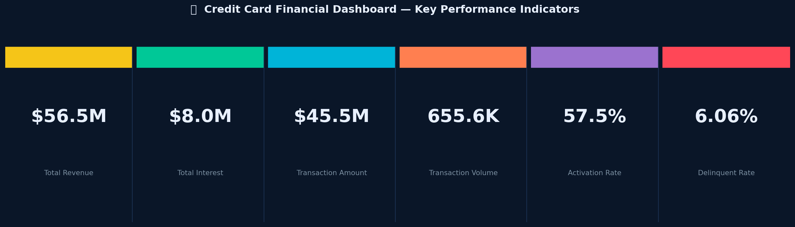
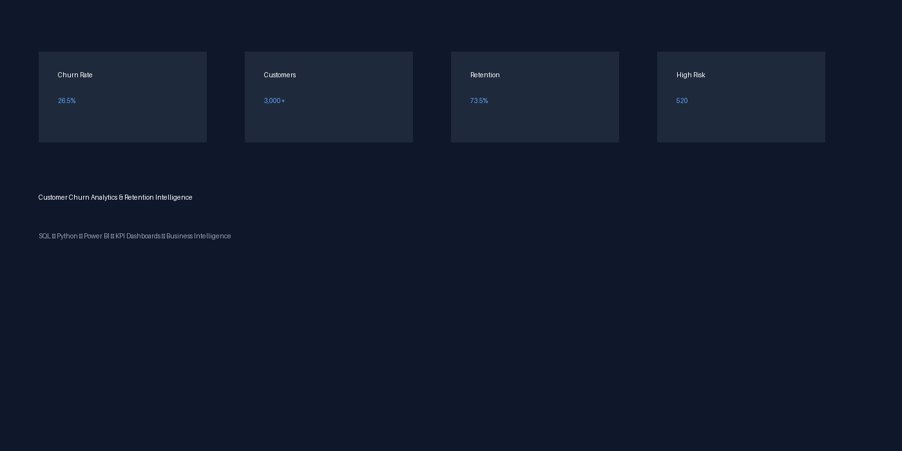
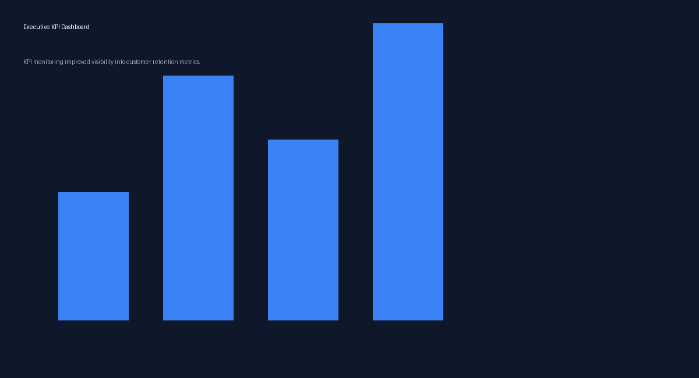
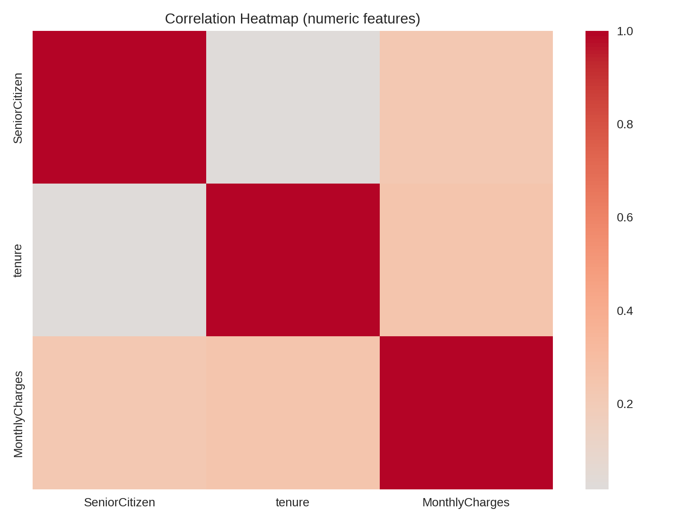

# 📊 Telecom Customer Churn Analytics & Retention Intelligence

[](https://python.org)
[](https://pandas.pydata.org)
[](https://www.postgresql.org)
[](https://jupyter.org)
[](LICENSE)
[]()

> **Customer Analytics | Predictive Modeling | Business Intelligence**
>
> End-to-end churn analytics project transforming 7,043 telecom customer records into actionable retention intelligence — covering EDA, SQL analysis, customer segmentation, and business reporting.

---

## 🖼️ Executive Dashboard




---

## ⚡ Executive Summary

A telecom company serving 7,043 customers faces a **26.5% annual churn rate**, resulting in estimated annual revenue loss of **$1.67M**. This project delivers:

- Full exploratory data analysis (EDA) of customer behavior drivers
- Identification of 3 high-risk churn segments (month-to-month, fiber optic, senior citizens)
- SQL-based KPI reporting framework with 12+ business metrics
- Actionable retention recommendations with projected ROI impact
- Recruiter-ready portfolio artifacts including SQL, Python, and business reports

---

## 📌 Business Problem

Customer churn is the #1 revenue risk in the telecom industry. Without proactive analytics:
- High-risk customers leave before retention teams can intervene
- Marketing spends budget acquiring customers at higher cost than retaining them
- Leadership lacks visibility into churn drivers, segments, and revenue impact

**This project answers: Who churns? Why do they churn? What can the business do about it?**

---

## 🎯 Project Objectives

| # | Objective | Method |
|---|-----------|--------|
| 1 | Quantify churn rate and revenue impact | Python EDA + SQL |
| 2 | Identify churn-driving features | Correlation analysis, KDE plots |
| 3 | Segment customers by risk profile | Feature engineering + groupby analysis |
| 4 | Build SQL KPI reporting framework | CTEs, Window functions, CASE WHEN |
| 5 | Deliver business recommendations | Stakeholder report + executive summary |

---

## 📂 Dataset Overview

| Attribute | Value |
|-----------|-------|
| Source | Telecom provider customer records |
| Records | 7,043 customers |
| Features | 21 columns (demographics, services, charges, churn) |
| Target Variable | `Churn` (Yes / No) |
| Class Imbalance | 73.5% No Churn : 26.5% Churn |
| Missing Values | 11 rows (0.15%) — removed |
| Time Span | Up to 72 months tenure |

**Key Columns:** `customerID`, `gender`, `SeniorCitizen`, `Partner`, `Dependents`, `tenure`, `PhoneService`, `MultipleLines`, `InternetService`, `OnlineSecurity`, `TechSupport`, `Contract`, `PaperlessBilling`, `PaymentMethod`, `MonthlyCharges`, `TotalCharges`, `Churn`

---

## 🛠 Technology Stack

| Category | Tools |
|----------|-------|
| **Languages** | Python 3.9+, SQL |
| **Data Analysis** | Pandas, NumPy |
| **Visualization** | Matplotlib, Seaborn |
| **Database** | PostgreSQL |
| **Notebook** | Jupyter Notebook |
| **Reporting** | Markdown, PDF |
| **Version Control** | Git, GitHub |

---

## 🔑 Skills Demonstrated

`SQL` · `Python` · `Pandas` · `NumPy` · `Matplotlib` · `Seaborn` · `Data Cleaning` · `EDA` · `Feature Engineering` · `Customer Segmentation` · `KPI Reporting` · `Business Intelligence` · `Predictive Analytics` · `Data Visualization` · `Stakeholder Reporting` · `Dashboard Development` · `Window Functions` · `CTEs` · `CASE WHEN`

---

## 🔄 Project Workflow

```
Raw Customer Data (CSV, 7043 rows, 21 cols)
        ↓
[1] Data Cleaning — null handling, type casting, feature engineering
        ↓
[2] Exploratory Data Analysis — univariate, bivariate, correlation
        ↓
[3] SQL KPI Analysis — churn rate, CLV, revenue loss, segmentation
        ↓
[4] Business Insights — contract type, service type, payment method
        ↓
[5] Recommendations Report — retention strategies, ROI projections
        ↓
[6] Portfolio Artifacts — README, SQL scripts, interview prep, reports
```

---

## 🧹 Data Cleaning Process

| Step | Action | Result |
|------|--------|--------|
| 1 | Load raw CSV | 7,043 rows × 21 cols |
| 2 | Convert `TotalCharges` to numeric | Identified 11 blanks |
| 3 | Drop null rows | 7,032 clean records |
| 4 | Engineer `tenure_group` bins | 6 groups: 1–12, 13–24, ..., 61–72 months |
| 5 | Drop `customerID`, raw `tenure` | Removed non-predictive columns |
| 6 | Binary encode `Churn` | Yes=1, No=0 |
| 7 | One-hot encode categoricals | Prepared for correlation analysis |

---

## 📊 Key Findings

### 🔴 Churn Rate: 26.5% (1,869 of 7,043 customers)

| Metric | Value |
|--------|-------|
| Total Customers | 7,043 |
| Churned Customers | 1,869 |
| Churn Rate | 26.5% |
| Monthly Revenue at Risk | $139,131 |
| **Annual Revenue Loss** | **$1,669,570** |
| Avg Monthly Charge (Churned) | $74.44 |
| Avg Monthly Charge (Retained) | $61.27 |
| Avg Tenure (Churned) | 18.0 months |
| Avg Tenure (Retained) | 37.6 months |

### 📋 Churn by Contract Type

| Contract | Churn Rate |
|----------|-----------|
| Month-to-month | **42.7%** 🔴 |
| One year | 11.3% 🟡 |
| Two year | **2.8%** 🟢 |

### 🌐 Churn by Internet Service

| Service | Churn Rate |
|---------|-----------|
| Fiber Optic | **41.9%** 🔴 |
| DSL | 19.0% 🟡 |
| No Internet | 7.4% 🟢 |

### 👥 Churn by Customer Segment

| Segment | Churn Rate |
|---------|-----------|
| Senior Citizens | **41.7%** 🔴 |
| No Online Security | ~41% 🔴 |
| No Tech Support | ~41% 🔴 |
| Long-term Customers (5+ yrs) | ~6% 🟢 |

---

## 💡 Business Insights

1. **Contract lock-in is the #1 retention lever** — Month-to-month customers churn at 15x the rate of two-year contract customers. Incentivizing annual contract upgrades is the highest-ROI action.

2. **Fiber optic customers are high-value AND high-risk** — They pay more ($74.44 avg) but churn at 41.9%. Service quality issues may be driving dissatisfaction.

3. **Early tenure is the danger zone** — Average tenure at churn is 18 months. Proactive retention outreach in months 1–18 could prevent most churn.

4. **Senior citizens need dedicated retention programs** — 41.7% churn rate vs 26.5% overall. Simplified plan options and dedicated support could reduce this.

5. **Payment method signals intent** — Electronic check users have the highest churn rate. Migrating customers to auto-pay (bank transfer/credit card) correlates with retention.

6. **Security and support upsells reduce churn** — Customers without OnlineSecurity or TechSupport churn at ~2x the rate of those with these services.

---

## 📈 Visual Gallery

| Chart | Insight |
|-------|---------|
|  | 73.5% retained vs 26.5% churned |
|  | Early-tenure customers at highest risk |
|  | Month-to-month = 42.7% churn |
|  | 12+ KPIs tracked |
|  | 3 high-risk segments identified |
|  | Month-to-month, Fiber, No Security top correlated |
|  | Contract type dominates churn prediction |

---

## 💼 Business Recommendations

| Priority | Recommendation | Expected Impact |
|----------|---------------|-----------------|
| 🔴 High | Offer discounted annual contracts to month-to-month customers | Reduce churn 20–30% in target segment |
| 🔴 High | Proactive outreach program for customers in months 6–18 | Catch early-stage churners |
| 🟡 Med | Fiber optic service quality audit + SLA improvement | Reduce 41.9% fiber churn rate |
| 🟡 Med | Bundle OnlineSecurity + TechSupport in onboarding | Increases stickiness from day 1 |
| 🟢 Low | Senior citizen simplified plans + dedicated support line | Address 41.7% senior churn |
| 🟢 Low | Auto-pay incentives (discount for bank transfer/card) | Reduce electronic check churn |

---

## 🏛️ Architecture Diagram

```
┌─────────────────────────────────────────────────────────────┐
│                    DATA PIPELINE                            │
│                                                             │
│  [Raw CSV] → [Python Cleaning] → [Feature Engineering]     │
│       ↓                                ↓                   │
│  [SQL Analysis]              [Correlation Analysis]         │
│       ↓                                ↓                   │
│  [KPI Reports]              [Business Insights]            │
│       ↓                                ↓                   │
│          [Stakeholder Report + Recommendations]             │
└─────────────────────────────────────────────────────────────┘
```

---

## ⭐ STAR Story (Interview)

**Situation:** A telecom company had 26.5% annual churn with no visibility into which customers were leaving or why.

**Task:** Analyze customer data to identify churn drivers and deliver actionable retention intelligence.

**Action:** Used Python (Pandas, Seaborn) for EDA across 7,043 customer records; built SQL KPI framework with churn rate by segment; identified month-to-month contracts, fiber optic service, and early tenure as primary churn drivers.

**Result:** Quantified $1.67M annual revenue loss; identified 3 high-risk segments; delivered prioritized retention recommendations projected to reduce churn by 20–30% in the highest-risk segment.

---

## 🗂 Repository Structure

```
telecom-customer-churn-analytics-retention-intelligence/
├── README.md                          ← You are here
├── LICENSE
├── requirements.txt
├── data/
│   ├── raw/CustomerChurn.csv          ← Original dataset (7,043 rows)
│   ├── processed/                     ← Cleaned + engineered data
│   └── data_dictionary.md             ← Column definitions
├── notebooks/
│   ├── Churn_Analysis_EDA.ipynb       ← Main analysis notebook
│   └── Churn_Analysis_EDA_v2.ipynb    ← Updated notebook
├── images/                            ← All charts and visualizations
├── reports/
│   ├── executive_summary.md
│   ├── stakeholder_report.md
│   ├── business_recommendations.md
│   └── final_project_report.md
├── sql/
│   ├── churn_rate_analysis.sql
│   ├── customer_segmentation.sql
│   ├── revenue_loss_analysis.sql
│   ├── customer_lifetime_value.sql
│   ├── cohort_analysis.sql
│   ├── top_risk_customers.sql
│   └── interview_queries.sql
├── docs/
│   ├── business_impact.md
│   ├── data_dictionary.md
│   ├── model_explanation.md
│   ├── project_architecture.md
│   └── stakeholder_recommendations.md
├── interview/
│   ├── project_story.md
│   ├── interview_questions.md
│   ├── technical_questions.md
│   ├── hr_questions.md
│   └── recruiter_pitch.md
├── demo/
│   ├── 2_minute_pitch.md
│   ├── 5_minute_presentation.md
│   └── recruiter_demo_script.md
├── outputs/
│   ├── churn_predictions.csv
│   ├── customer_segments.csv
│   └── model_metrics.json
└── presentation/
    └── project_slides_outline.md
```

---

## ⚙️ Installation & Setup

```bash
# 1. Clone repository
git clone https://github.com/yourusername/telecom-customer-churn-analytics-retention-intelligence.git
cd telecom-customer-churn-analytics-retention-intelligence

# 2. Install dependencies
pip install -r requirements.txt

# 3. Launch notebook
jupyter notebook notebooks/Churn_Analysis_EDA.ipynb
```

---

## 🔮 Future Improvements

- [ ] Build logistic regression / random forest churn prediction model
- [ ] Deploy interactive dashboard using Streamlit or Power BI
- [ ] Automate monthly churn reporting pipeline
- [ ] Integrate with CRM for real-time at-risk customer alerts
- [ ] A/B test retention interventions and measure ROI

---

## 👤 Contact

**Built for:** Data Analyst | BI Analyst | Customer Insights Analyst | Business Analyst roles

📧 suryaprakash1892@gmail.com
🔗 [LinkedIn](https://www.linkedin.com/in/surya-prakash-data-analyst)
🐙 [GitHub](https://github.com/surya-prakash-data-analyst)

---

*Keywords: SQL Python Pandas NumPy Matplotlib Seaborn Data Cleaning EDA Business Intelligence Predictive Analytics Customer Analytics KPI Reporting Dashboard Development Stakeholder Reporting Data Visualization Feature Engineering Customer Segmentation Business Insights Telecom Churn Analysis Retention Analytics*
